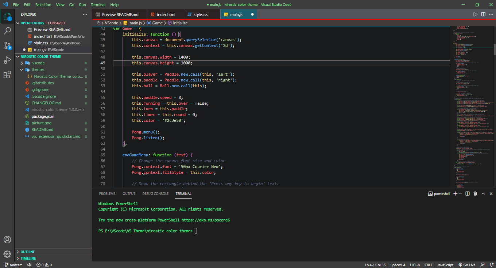

# Nirostic Color Theme

*This is a minimal Visual Studio Theme with bright colors and dark background.*

## Screenshot

## Installation

1. Open the *Extensions* sidebar in VS Code
2. Search for *`Nirostic Color Theme`*
3. Click *Install*
4. Enjoy.! 🎉

## Resources

- [VS Code Theme Color Reference](https://code.visualstudio.com/api/references/theme-color)
- [Find color schemes](https://coolors.co/)
- [Get color palettes from an image](https://hexcolor.co/image-to-colors)
- [VS Code Extension Documentation](https://code.visualstudio.com/api/get-started/your-first-extension)

> See it *[here](https://marketplace.visualstudio.com/items?itemName=NirjhorSaha.nirostic-color-theme)* on the Visual Studio Code Marketplace.

